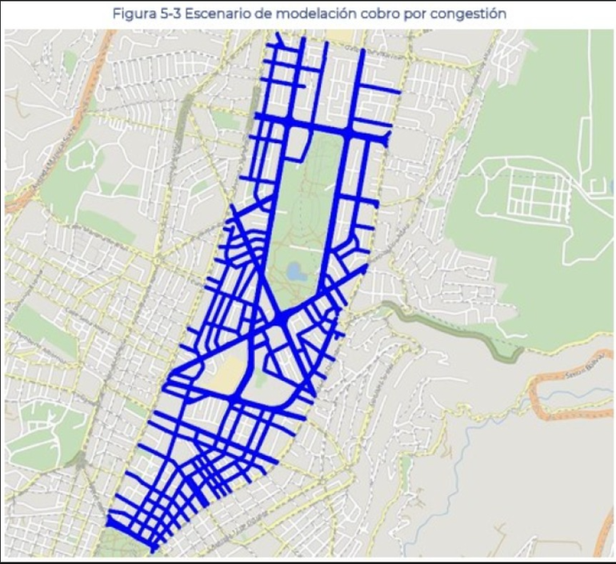
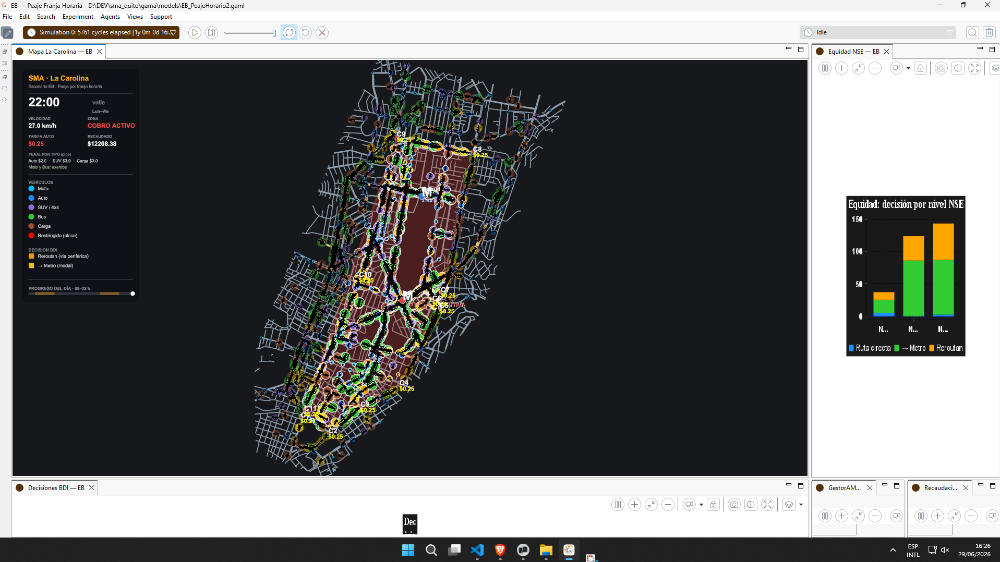
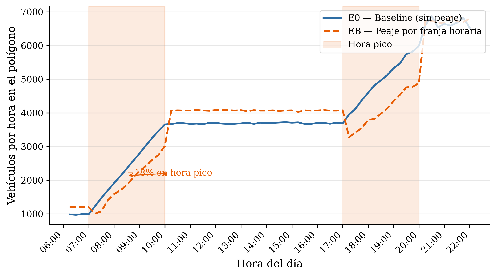
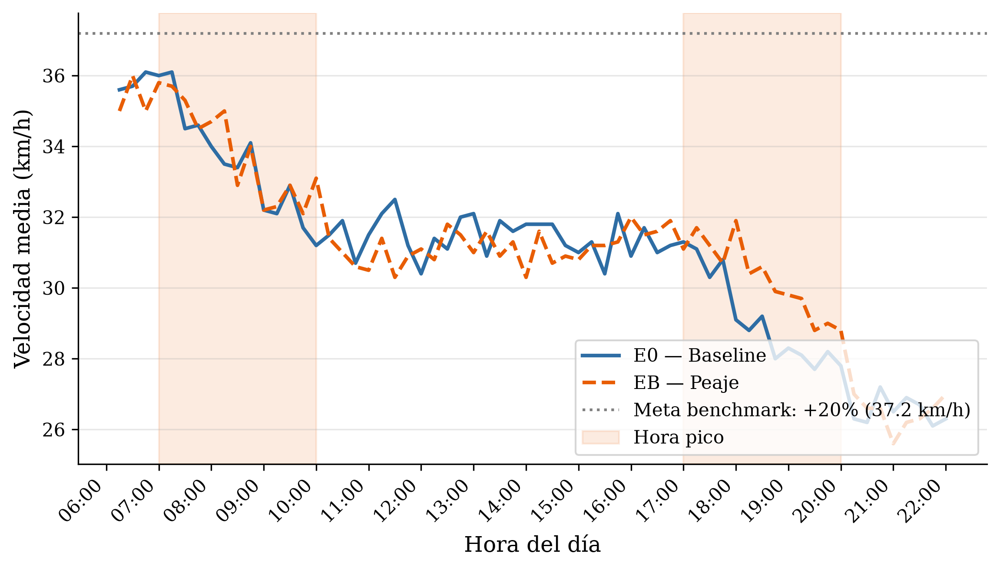
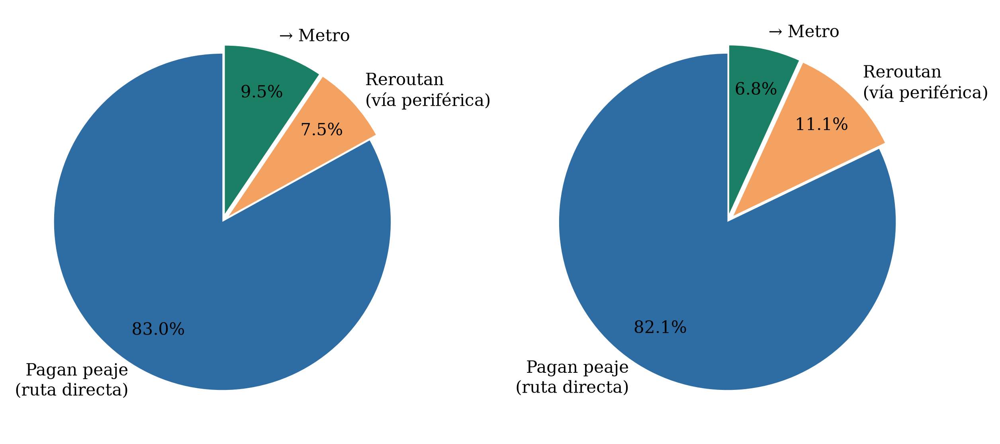
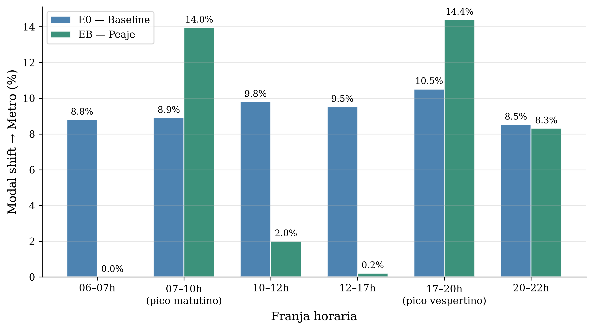
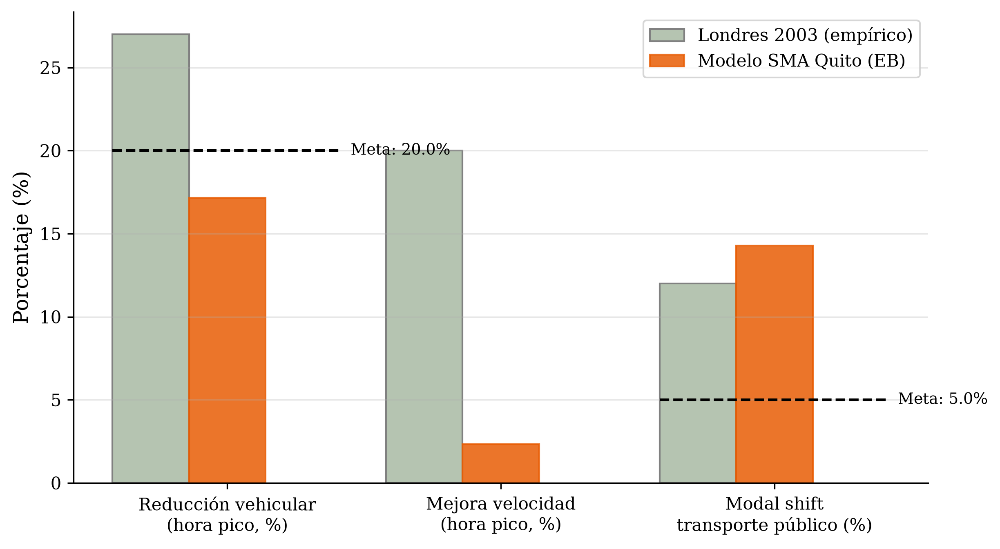
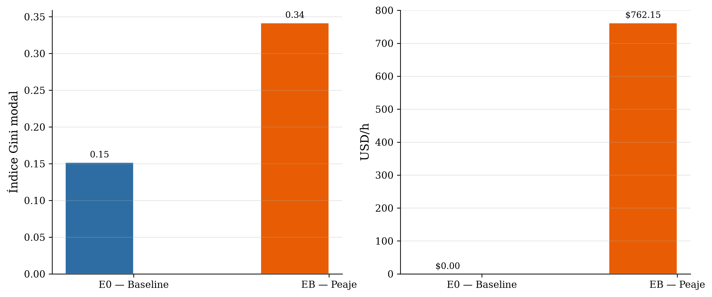
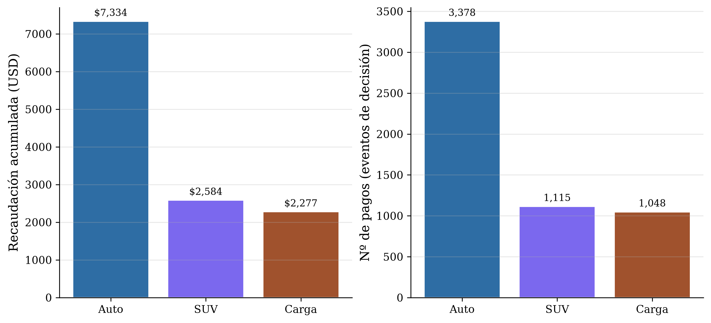

# Simulación Multiagente del Impacto de una Zona de Cobro por Congestión en el Sector Parque La Carolina: Evaluación de Políticas de Movilidad Urbana en Quito Mediante Arquitectura BDI

**Ariel Elizalde, Edison Enríquez, Angelo Silva, Stalin Acurio, Alexis Troya**

Carrera de Computación, Facultad de Ingeniería y Ciencias Aplicadas
Universidad Central del Ecuador, Quito, Ecuador
`{amelizalde, erenriquezp, amsilvac1, svacurio, aetroyab}@uce.edu.ec`

Asignatura: Sistemas Colaborativos (TGP09BFT03) — Período Académico 2026

---

## Resumen

En este trabajo se desarrolló y evaluó un modelo de Simulación Multiagente (SMA) orientado a estimar el impacto de una zona de cobro por congestión en el polígono comercial y financiero del Parque La Carolina, en el Distrito Metropolitano de Quito. Sobre la plataforma GAMA y con datos geoespaciales reales procesados en QGIS, se integró la red vial vectorial y se modelaron conductores heterogéneos —diferenciados por nivel socioeconómico y por cinco tipos de vehículo— parametrizados con reglas deliberativas Creencia–Deseo–Intención (BDI), cuyas funciones de utilidad multicriterio ponderaron tiempo de viaje, costo financiero y comodidad. Se contrastó un escenario base sin peaje (E0) frente a un esquema de peaje por franja horaria con tarifas diferenciadas por tipo de vehículo y ajuste dinámico mediante un agente gestor (EB), tomando como referente el London Congestion Charge. Los resultados mostraron que el peaje redujo el flujo vehicular interno en hora pico un 17.2 % e incrementó la transferencia modal al Metro un 45 % en esa franja (de 9.8 % a 14.3 %), único efecto estadísticamente significativo (p = 0.004); el agente gestor ejerció su rango dinámico, escalando la tarifa base del auto de \$2.00 al techo de \$3.00 ante densidad alta y recaudando \$12 194 en el día. Sin embargo, la reducción no alcanzó el umbral del 20 % planteado y se observó un desplazamiento periférico del 52.7 %, por lo que la hipótesis principal no se confirmó. Se concluyó que el instrumento operó correctamente, con beneficios moderados pero efectos colaterales relevantes bajo la tarifa evaluada.

**Palabras clave—** Simulación multiagente, arquitectura BDI, tarificación por congestión, GAMA, QGIS, modelado basado en agentes, movilidad urbana, Quito.

---

## 1. Introducción

El Distrito Metropolitano de Quito (DMQ) registra una saturación crítica de su infraestructura vial por el crecimiento sostenido de un parque automotor que supera las 600 000 unidades en circulación activa [10]. Esta presión genera externalidades negativas que degradan la productividad de la capital: pérdida de horas-persona en congestión, mayor consumo energético y aumento de emisiones. El sector del Parque La Carolina —delimitado por las avenidas Naciones Unidas, Amazonas, De los Shyris, Eloy Alfaro y 6 de Diciembre— concentra el núcleo financiero de la urbe y, por la convergencia de viajes pendulares, carece de mecanismos automatizados de gestión adaptativa de la demanda.

Ante la propuesta conceptual del Municipio del DMQ de implementar una zona de tarificación vial en este sector, se identifica un vacío de evidencia computacional publicada que evalúe cuantitativamente la viabilidad de la medida en el contexto específico de Quito. Los modelos agregados tradicionales fallan al promediar las conductas individuales; por ello, el Modelado Basado en Agentes (ABM) resulta idóneo, pues representa la heterogeneidad de los conductores, captura la emergencia de fenómenos sistémicos —como el desplazamiento del tráfico hacia vías periféricas— y permite evaluar impactos de equidad socioeconómica [2], [4]. La tarificación dinámica mediante agentes deliberativos es, además, una línea metodológica activa en la ingeniería de transporte sostenible [1], [3].

El **objetivo general** es desarrollar un SMA con arquitectura BDI e integración de datos geoespaciales reales que simule y evalúe el impacto de una zona de cobro por congestión en el sector Parque La Carolina. Como **objetivos específicos** se plantean: (i) integrar la red vial real del polígono en un entorno de simulación geolocalizado; (ii) modelar el comportamiento deliberativo de distintos perfiles de conductores mediante funciones de utilidad multicriterio; y (iii) contrastar cuantitativamente un escenario base frente a un escenario de peaje dinámico, comparándolo con el referente empírico de Londres.

El estudio se guía por la **hipótesis** de que la implementación de una tarifa dinámica reduce el volumen vehicular de paso interno en al menos un 20 %, incrementa el uso intermodal del Metro de Quito y no provoca un colapso por desvío en las arterias periféricas. El umbral del 20 % se establece tomando como referencia el −27 % observado en el London Congestion Charge durante sus primeros seis meses (2003) [5], [6]. El aporte de este trabajo es ofrecer la primera evidencia computacional de tarificación por congestión, basada en agentes BDI con datos geoespaciales reales, para una ciudad andina latinoamericana con un sistema de Metro de operación reciente.

---

## 2. Marco Teórico y Trabajo Relacionado

El control de la congestión urbana mediante sistemas multiagente constituye una línea activa de la ingeniería de transporte sostenible [2], [4]. Los enfoques reactivos tradicionales son superados por arquitecturas deliberativas cognitivas como el modelo BDI (Creencias, Deseos, Intenciones), formalizado por Rao y Georgeff [11]. En un ecosistema de transporte urbano:

- **Creencias** — estado informacional del conductor: posición en la red, tarifa vigente en los puntos de control y restricciones activas por el sistema local de "tercera placa".
- **Deseos** — objetivos individuales: minimizar el tiempo de viaje, reducir los costos financieros directos y resguardar el confort.
- **Intenciones** — el plan comprometido tras la deliberación: mantener la ruta pagando el peaje, desviarse (*rerouting*) por la periferia o ejecutar un cambio intermodal hacia el Metro.

Alineado con los fundamentos de los sistemas colaborativos y la ingeniería de sistemas complejos [9], el entorno de simulación se clasifica como parcialmente observable, dinámico y continuo. La coordinación sistémica se alcanza mediante un agente facilitador (Gestor AMT) que emite señales tarifarias en función de la densidad global del área, buscando optimizar la eficiencia de la red de forma distribuida, en línea con los esquemas de *congestion pricing* basados en agentes reportados en la literatura [1], [3].

---

## 3. Metodología

La construcción y calibración del simulador se ejecutó de forma cronológica en tres fases: preparación geoespacial, especificación conductual BDI y diseño experimental de escenarios.

### 3.1 Pipeline de integración geoespacial

Se delimitó el polígono de estudio del Parque La Carolina en QGIS 3.x. Mediante el complemento QuickOSM se descargó la red vial vectorial real desde OpenStreetMap y se aplicó una limpieza topológica para eliminar nodos duplicados, corregir el sentido de los flujos y estructurar el grafo de conectividad. Se vectorizaron las capas de los cinco accesos semaforizados (puntos de control C1–C5) y la ubicación de las estaciones del Metro adyacentes (Iñaquito y La Carolina). La base geoespacial se exportó en formato Shapefile bajo la proyección UTM Zona 17S (EPSG:32717), asegurando precisión métrica al importarse en GAMA mediante la capa `road_network`.

**Fig. 1.** Polígono georreferenciado del Parque La Carolina (QGIS): red vial vectorial real de la zona de cobro por congestión, sobre la cartografía base de Quito.

### 3.2 Parametrización y función de utilidad de los agentes

Se codificaron en lenguaje GAML conductores BDI gobernados por dos identidades superpuestas. La primera es el **nivel socioeconómico (NSE)** —Alto, Medio y Bajo—, que fija la disposición a pagar ($wtp$), los pesos de la función de utilidad y el umbral de congestión que dispara la deliberación (Tabla I). La segunda es el **tipo de vehículo**, que determina la velocidad libre, el factor de ocupación de vía y la exoneración o no del peaje (Tabla II). Esta doble parametrización es el mecanismo que habilita el análisis de equidad: distintos perfiles enfrentan el mismo cobro con distinta elasticidad.

**Tabla I.** Parámetros por nivel socioeconómico (NSE).

| NSE | Proporción | $wtp$ (USD) | $w_1$ (tiempo) | $w_2$ (costo) | $w_3$ (comodidad) | Umbral congestión |
|---|---:|---:|---:|---:|---:|---:|
| Alto | 15 % | 3.00 | 0.35 | 0.15 | 0.50 | 0.40 |
| Medio | 45 % | 2.25 | 0.35 | 0.35 | 0.30 | 0.55 |
| Bajo | 40 % | 0.50 | 0.20 | 0.65 | 0.15 | 0.70 |

**Tabla II.** Tipos de vehículo, flota inicial (300 agentes) y tratamiento tarifario.

| Tipo | Flota | Factor de vía | Tarifa pico (USD) | Observación |
|---|---:|---:|---:|---|
| Moto | 45 (15 %) | 0.3 | **Exonerado** | Mayor agilidad; umbral reducido. |
| Auto | 165 (55 %) | 1.0 | 2.00 | Tarifa base de referencia. |
| SUV | 45 (15 %) | 1.5 | 3.00 | Paga 1.5× la tarifa base del auto. |
| Bus | 30 (10 %) | 3.0 | **Exonerado** | Ruta fija; NSE Bajo forzado. |
| Carga | 15 (5 %) | 2.5 | 3.00 | Mayor impacto vial (1.5× el auto). |

La toma de decisiones intermodal y de enrutamiento se gobernó mediante la función de utilidad multicriterio de la ecuación (1):

$$U(\text{alt}) = w_1 \cdot \frac{1}{T_v} + w_2 \cdot \frac{1}{C} + w_3 \cdot C_p \tag{1}$$

donde $T_v$ es el tiempo estimado de viaje, $C$ el costo económico directo asociado a la tarifa y $C_p$ el coeficiente de comodidad percibida del modo. El conductor selecciona la intención de máxima utilidad entre RUTA_DIRECTA, REROUTEAR y METRO; cuando la tarifa efectiva supera su disposición a pagar ($\tau_{ef} > wtp$), la utilidad de la ruta directa se penaliza, forzando una alternativa.

A diferencia de la propuesta conceptual inicial de una tarifa plana, el modelo final aplicó una **señal tarifaria diferenciada por tipo de vehículo y activa solo en franja pico**, según la ecuación (2):

$$\tau_k(t) = \begin{cases} \$2.00 & k = \text{Auto},\ t \in \text{pico} \\ \$3.00 & k \in \{\text{SUV, Carga}\},\ t \in \text{pico} \\ \$0.00 & k \in \{\text{Moto, Bus}\} \ \lor\ t \notin \text{pico} \end{cases} \tag{2}$$

con franjas pico de 07:00–10:00 y 17:00–20:00. La tarifa que cada agente realmente paga (**tarifa efectiva**) escala la tarifa base de su tipo por un factor dinámico $f_g$ fijado por el gestor, según la ecuación (3):

$$\tau_{ef} = \tau_k \cdot f_g, \quad f_g = \frac{\tau_{\text{din}}}{\tau_{\text{Auto}}}, \quad \tau_{ef}=0 \text{ si el tipo está exonerado o } t \notin \text{pico} \tag{3}$$

donde $\tau_{\text{din}}$ es la tarifa de auto vigente que define el gestor. Así, una elevación del factor $f_g$ encarece proporcionalmente a todos los tipos no exonerados (p. ej., con $f_g=1.5$ el auto paga \$3.00 y SUV/Carga \$4.50). Sobre esta señal base operó un **agente gestor (GestorAMT)** con arquitectura BDI deliberativa que, cada 30 ciclos, ajustó dinámicamente $\tau_{\text{din}}$ en el rango $[\$0.50,\ \$3.00]$ en pasos de $\$0.25$, seleccionando entre las intenciones MANTENER, SUBIR, BAJAR o SUSPENDER en función de la densidad del polígono, la velocidad media y la saturación del Metro, y difundiéndola a los puntos de control mediante un patrón FIPA.

El indicador de desempeño central se definió como la reducción porcentual del flujo vehicular interno entre el escenario base (0) y el regulatorio (B), expresada en la ecuación (4):

$$\Delta Q_{int} = \frac{Q_{int}^{(0)} - Q_{int}^{(B)}}{Q_{int}^{(0)}} \times 100\% \tag{4}$$

Para evaluar la equidad, se calculó el **índice de Gini modal** sobre la participación del Metro por estrato NSE, según la ecuación (5):

$$G = \frac{n + 1 - 2\sum_{i=1}^{n}\left(\dfrac{\sum_{j=1}^{i} x_{(j)}}{\sum_{j=1}^{n} x_{(j)}}\right)}{n} \tag{5}$$

donde $x_{(j)}$ son las cuotas de uso del Metro ordenadas por estrato. Para este análisis se aplicó una corrección que descuenta la contribución de los buses (siempre RUTA_DIRECTA y NSE Bajo por diseño), evitando inflar artificialmente ese contador.

**Fig. 2.** Entorno de GAMA Platform ejecutando el escenario EB al cierre del día (22:00): flota heterogénea sobre la red de La Carolina, puntos de control C1–C11, zona de cobro activa y los paneles de equidad NSE y recaudación acumulada (\$12 208).

### 3.3 Especificación de escenarios

Se ejecutaron computacionalmente dos escenarios en un horizonte simulado de 06:00 a 22:00 (paso de 10 s, exportación de métricas cada ~15 min sim):

1. **Escenario E0 (línea base):** situación vial actual del DMQ con esquema de Pico y Placa activo, sin cobros por circulación interna y con la oferta base del Metro. Los puntos de control existen pero no cobran.
2. **Escenario EB (peaje por franja horaria):** misma flota y red que E0, más la maquinaria de cobro. El peaje se activó solo en franja pico con tarifas diferenciadas por tipo de vehículo (Auto $2.00, SUV y Carga $3.00; Moto y Bus exonerados), gestionado dinámicamente por el GestorAMT en el rango $[\$0.50,\ \$3.00]$. Operó con tercera placa activa (≈20 % de la flota, restricción 06:00–20:00) y modal shift hacia dos estaciones del Metro (Iñaquito y La Carolina).

Ambos escenarios partieron de una flota de 300 conductores que se incrementó mediante inyecciones de tráfico en hora pico (hasta ~1928 agentes activos al cierre del día), reproduciendo las oleadas de ingreso al cordón. La velocidad media se midió dentro de la zona de cobro como $V_{libre} \times$ coeficiente de congestión, para no diluir el efecto del peaje con la red periférica. Cada escenario produjo 64 registros temporales que la canalización en Python (pandas/NumPy/SciPy) procesó para generar las tablas comparativas, las pruebas estadísticas y las figuras.

---

## 4. Resultados

Las series temporales y métricas agregadas se exportaron en archivos tabulares tras la ejecución de los ciclos en GAMA. Los resultados consolidados se presentan en la Tabla 1.

**Tabla 1.** Comparativa de métricas de rendimiento de la red vial (E0 vs EB).

| Variable evaluada | E0 (base) | EB (peaje) | Δ % | ¿Mejora? |
|---|---:|---:|---:|:---:|
| Flujo interno — total (veh/h) | 3913.00 | 3839.00 | −1.89 | ✓ |
| **Flujo interno — hora pico (veh/h)** | 3635.69 | 3011.85 | **−17.16** | ✓ |
| Desplazamiento periférico (veh/h) | 344.50 | 525.94 | +52.67 | ✗ |
| Velocidad media — total (km/h) | 30.99 | 31.14 | +0.48 | ✓ |
| **Velocidad media — hora pico (km/h)** | 31.35 | 32.08 | **+2.34** | ✓ |
| Modal shift → Metro — total (%) | 9.45 | 6.80 | −28.05 | ✗ |
| **Modal shift → Metro — hora pico (%)** | 9.83 | 14.29 | **+45.34** | ✓ |
| Δ Gini modal — hora pico (0–1) | 0.12 | 0.10 | −16.19 | ✓ |
| Δ Gini modal — promedio diario (0–1) | 0.15 | 0.34 | +125.16 | ✗ |
| Recaudación estimada (USD/h) | 0.00 | 762.15 | — | — |

La respuesta dinámica del volumen interno ante la activación de la ventana tarifaria se grafica en la Fig. 3, y la velocidad media comparada en la Fig. 4. La bifurcación de intenciones (modal shift) entre perfiles se visualiza en las Figs. 5 y 6, el contraste con el referente de Londres en la Fig. 7, y la equidad, recaudación y diferenciación tarifaria en las Figs. 8 y 9.

**Fig. 3.** Curvas temporales del volumen de vehículos activos dentro del perímetro de La Carolina (E0 vs EB) a lo largo del día.

**Fig. 4.** Evolución de la velocidad media dentro del polígono de cobro (E0 vs EB).

**Fig. 5.** Distribución de intenciones de la flota (ruta directa / rerouting / Metro) por escenario.

**Fig. 6.** Transferencia modal hacia el Metro por franja horaria (E0 vs EB).

**Fig. 7.** Comparación de los indicadores del modelo EB frente a las metas del London Congestion Charge.

**Fig. 8.** Índice de Gini modal y recaudación acumulada del escenario EB.

**Fig. 9.** Recaudación acumulada y número de pagos por tipo de vehículo (Auto, SUV, Carga; Moto y Bus exonerados).

Durante la hora pico, el peaje redujo el flujo interno de 3635.7 a 3011.9 veh/h (−17.16 %) y elevó la velocidad media de 31.35 a 32.08 km/h (+2.34 %). La transferencia modal al Metro en pico creció de 9.83 % a 14.29 % (+45.34 %). En contraste, el desplazamiento periférico aumentó un 52.67 % (de 344.5 a 525.9 veh/h), evidenciando la reasignación de parte del tráfico hacia vías no cobradas. El índice de Gini modal en hora pico se mantuvo prácticamente estable (0.12 → 0.10), pero su promedio diario empeoró (0.15 → 0.34): al activarse el cobro solo en pico, el uso del Metro se concentra en esas franjas y cae casi a cero en valle, lo que eleva la desigualdad modal medida sobre el día completo. A diferencia de corridas previas, el GestorAMT ejerció plenamente su margen dinámico: escaló la tarifa base del auto desde $2.00 hasta el techo de $3.00 (factor 1.5) en ambas franjas pico ante densidad alta, encareciendo proporcionalmente a SUV y Carga hasta $4.50. El escenario EB acumuló una recaudación de 12 194 USD (~762.15 USD/h simulada), desglosada por tipo de vehículo en la Tabla 3. Las pruebas t de Student arrojaron significancia únicamente para la transferencia modal (pct_metro: p = 0.004), mientras que el flujo (p = 0.785) y la velocidad (p = 0.740) no resultaron significativos. La Tabla 2 contrasta estos hallazgos con las metas del benchmark.

**Tabla 2.** Validación contrafactual frente al London Congestion Charge.

| Indicador | Londres 2003 | Meta Quito | Modelo EB | ¿Cumple? |
|---|---|---|---:|:---:|
| Reducción vehicular (hora pico) | −27 % | ≥ −20 % | −17.2 % | ✗ |
| Mejora de velocidad (hora pico) | +20 % | > 0 % | +2.3 % | ✓ |
| Modal shift a transporte público | ~12 % | > 5 % | ~14.3 % | ✓ |
| Tarifa pico | £5 ≈ $6.0 USD | $2.00–$3.00 propuesto | Auto $2–3 · SUV/Carga $3–4.5 (dinámica) · Moto/Bus exentos | — |

**Tabla 3.** Recaudación acumulada por tipo de vehículo (escenario EB, día completo).

| Tipo de vehículo | Recaudación (USD) | Nº de pagos | Tarifa media efectiva (USD) |
|---|---:|---:|---:|
| Auto | 7 334.00 | 3 378 | 2.17 |
| SUV | 2 583.75 | 1 115 | 2.32 |
| Carga | 2 276.63 | 1 048 | 2.17 |
| Moto / Bus | 0.00 | 0 | 0.00 (exonerados) |
| **Total** | **12 194.38** | **5 541** | — |

La tarifa media efectiva por pago es similar entre tipos pese a las bases diferenciadas (SUV/Carga = 1.5× el auto): cuando el factor dinámico elevó las tarifas de SUV y Carga por encima de la disposición a pagar de muchos de esos conductores, estos se desviaron o cambiaron de modo en lugar de pagar, de modo que los pagos efectivamente registrados se concentran en los tramos de tarifa más baja.

---

## 5. Discusión

Los patrones emergentes de la simulación evidenciaron una correspondencia direccional con las teorías de gestión de demanda de transporte: al imponerse la penalización financiera en EB, los conductores modificaron sus intenciones en función de su elasticidad económica, desviándose hacia la periferia o transfiriéndose al Metro para preservar su utilidad. Este comportamiento confirmó que el mecanismo BDI operó correctamente y que el modelo constituye una herramienta de evaluación válida, con independencia del signo del resultado de política.

No obstante, la magnitud del efecto, aunque relevante, se quedó por debajo del referente de validación. La evidencia muestra que un peaje urbano reduce el volumen de tráfico que ingresa a la zona central entre un 15 y un 27 % y disminuye la congestión en torno a un 30 % durante el primer año, incrementando las velocidades de circulación [5], [6], [7]. En el presente modelo, la reducción de flujo en hora pico (−17.2 %) se ubicó dentro del rango inferior empírico de Londres (−15 %) pero no alcanzó el umbral de validación del 20 %, por lo que **la hipótesis principal no se confirmó**. Tres factores explican esta brecha. Primero, pese a que el GestorAMT escaló la tarifa hasta su techo ($3.00 para el auto, $4.50 para SUV/Carga), las tarifas evaluadas siguieron siendo menores que la de Londres (£5 ≈ $6.0 USD en 2003); además, la exoneración de motos y buses —los modos más numerosos tras el auto— acotó la fracción de flota efectivamente disuadida, traduciéndose en una elasticidad de demanda débil. Segundo, se observó un fuerte efecto de desplazamiento periférico (+52.7 %), coherente con la literatura que advierte que parte del tráfico se reasigna a vías no cobradas en lugar de desaparecer [6]; este desvío explica buena parte de la caída de flujo interno. Tercero, el peaje no agravó la inequidad modal dentro de la franja de cobro (Gini pico 0.12 → 0.10), pero sí elevó la desigualdad modal medida sobre el día completo (Gini promedio 0.15 → 0.34), al concentrar el uso del Metro en las horas pico y dejarlo casi nulo en valle; este patrón temporal, más que un sesgo socioeconómico directo, es el origen del deterioro del indicador diario.

Se identifica, además, una diferencia analítica crucial respecto a Londres: la capital británica contaba con una red de transporte público madura antes del cobro, mientras que el Metro de Quito opera comercialmente solo desde diciembre de 2023 [8]. Los datos de calibración indican que ~15 % de los usuarios actuales del Metro migró desde el vehículo particular (~10 000 autos/día ya removidos), de modo que la simulación midió el efecto *adicional* del peaje superpuesto a una absorción modal base aún en consolidación. Esto sugiere que el bajo rendimiento observado responde al diseño tarifario y a la madurez del sistema de absorción, más que a una inviabilidad estructural del instrumento.

Como limitación metodológica, las velocidades medias simuladas (~31 km/h) excedieron el rango empírico de hora pico del DMQ (14–18 km/h), por lo que los valores absolutos deben leerse como tendencias relativas entre escenarios y no como predicciones puntuales. Asimismo, la colocación interactiva de los puntos de control en los modelos configurables limita por ahora la reproducibilidad en ejecución desatendida.

---

## 6. Conclusiones

El desarrollo del modelo multiagente integrando GAMA Platform y QGIS 3.x permitió evaluar con rigor el impacto de una política de tarificación vial en un entorno urbano andino. Respecto al **primer objetivo**, se concluyó que la ingesta de las redes viales vectoriales reales desde OpenStreetMap constituyó una plataforma geométrica de alta fidelidad, adecuada para el monitoreo de los flujos continuos. En relación con el **segundo objetivo**, los perfiles basados en la arquitectura BDI capturaron exitosamente las respuestas conductuales heterogéneas ante estímulos económicos disuasorios, superando las limitaciones de los enfoques promediados; el mecanismo deliberativo operó de forma consistente en ambos escenarios. Atendiendo al **tercer objetivo**, la comparación sistemática determinó que la zona de cobro disminuyó el tráfico de paso interno en hora pico (−17.2 %) e incrementó significativamente la demanda del Metro (+45 %, p = 0.004), con el agente gestor ejerciendo plenamente su rango dinámico hasta el techo tarifario; pero **no alcanzó el umbral de reducción del 20 %** y generó una externalidad de desplazamiento periférico (+52.7 %) y una concentración temporal del uso del Metro que deterioró la equidad modal en el promedio diario.

En consecuencia, bajo los parámetros evaluados, el modelo no respaldó la hipótesis principal: el peaje propuesto produjo beneficios moderados con efectos colaterales relevantes. Este hallazgo, lejos de invalidar el instrumento, demostró su utilidad como herramienta predictiva de soporte a la decisión para el Plan Maestro de Movilidad del Municipio de Quito, capaz de anticipar que la medida —tal como está diseñada— rendiría poco. Como **trabajo futuro** se planteó: (i) elevar el techo tarifario del gestor por encima de los $3.00 actuales hacia el rango $3–6 USD y revisar la exoneración de motos —que concentran parte del flujo disuasible— reejecutando EB; (ii) revisar la distribución de disposición a pagar y los umbrales de congestión por NSE; (iii) incorporar mecanismos de mitigación de equidad (exenciones por estrato socioeconómico); (iv) calibrar el modelo con aforos reales y externalidades ambientales; y (v) extender el análisis a los escenarios de peaje fijo 24 h y tarifa dinámica en tiempo real.

---

## Referencias

[1] *MAGT-toll: A multi-agent reinforcement learning approach to dynamic traffic congestion pricing.* PLOS ONE, vol. 19, no. 11, nov. 2024. DOI: 10.1371/journal.pone.0313828. *(Q1)*

[2] *Controlling Traffic Congestion in Urbanised City: A Framework Using Agent-Based Modelling and Simulation Approach.* ISPRS Int. J. Geo-Inf., vol. 12, no. 6, p. 226, 2023. DOI: 10.3390/ijgi12060226. *(Q2)*

[3] *Congestion pricing in a real-world oriented agent-based simulation context.* Transport Policy, 2019. DOI: 10.1016/j.tranpol.2017.12.002. *(Q1)*

[4] *Agent-based models in urban transportation: review, challenges, and opportunities.* European Transport Research Review, Springer, vol. 15, 2023. DOI: 10.1186/s12544-023-00590-5. *(Q1)*

[5] *The Cost of Traffic: Evidence from the London Congestion Charge.* Journal of Urban Economics, vol. 115, pp. 103–118, 2020. *(Q1)*

[6] *The city-wide effects of tolling downtown drivers: Evidence from London's congestion charge.* Journal of Urban Economics, vol. 140, p. 103636, 2024. DOI: 10.1016/j.jue.2024.103636. *(Q1)*

[7] *The impact of the London congestion charging scheme on air quality.* Atmospheric Environment, 2012. PMID: 21830496. *(Q1)*

[8] Empresa Pública Metropolitana Metro de Quito (EPMMQ), *Boletín Estadístico Operacional #2.* Quito, Ecuador, Tech. Rep., feb. 2025.

[9] N. Gómez-Cruz, *Vida artificial: Ciencia e ingeniería de sistemas complejos.* Quito, Ecuador: Editorial Universidad Central, 2013.

[10] Instituto Nacional de Estadística y Censos (INEC), *Anuario de Estadísticas de Transporte.* Quito, Ecuador, Tech. Rep., 2023.

[11] M. P. Georgeff and A. S. Rao, *BDI agents: From theory to practice,* in Proc. 1st Int. Conf. Multi-Agent Systems (ICMAS), San Francisco, CA, USA, 1995, pp. 312–319.

---

*Universidad Central del Ecuador — Facultad de Ingeniería y Ciencias Aplicadas. Asignatura Sistemas Colaborativos (TGP09BFT03), Noveno Semestre, 2026.*
